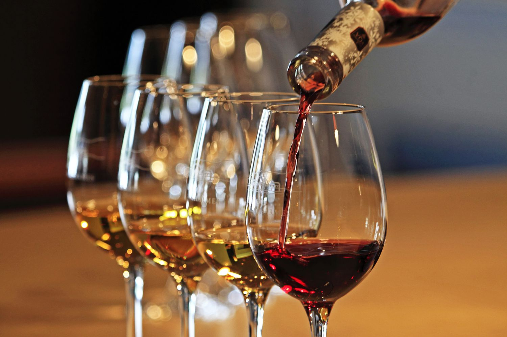

```{r setup, include=FALSE}
knitr::opts_chunk$set(echo = FALSE, warning = FALSE, message = FALSE)

library(tidyverse)
library(rsample)
library(recipes)
library(parsnip)
library(workflows)
library(tune)
library(yardstick)
library(glmnet)
library(rpart)
library(rpart.plot)
library(corrplot)
```

##  Introduction


Wine quality is shaped by a complex interaction of chemical properties, including acidity, sugar levels, sulphates, and alcohol content. Although the evaluation of wine is often considered subjective, these measurable characteristics provide a foundation for understanding why some wines are perceived as higher quality than others. In particular, physicochemical properties influence taste, aroma, and balance, all of which contribute to a wine’s overall rating. By examining these variables quantitatively, it becomes possible to move beyond subjective judgment and instead analyze wine quality through a data-driven perspective.

<br>



<br>

The goal of this project is to explore how these chemical properties relate to wine quality and to determine whether it is possible to accurately predict quality using statistical models. Using a dataset of red wine samples, we will first conduct exploratory data analysis to identify patterns and relationships between variables. We will then implement several predictive models to assess how well wine quality can be explained by the available features. Through this process, we aim to identify the most influential predictors of quality and evaluate the effectiveness of different modeling approaches in capturing these relationships.

## Data Description and Preparation

Before conducting any analysis, we begin by loading the dataset and examining its structure. This step is important because it allows us to understand what variables are available, how the data is organized, and whether any preprocessing is required before moving forward.

The dataset used in this project was obtained from Kaggle and contains physicochemical measurements of wine samples along with a quality score assigned to each observation. Each row represents a different wine, while each column corresponds to a specific chemical property or the response variable.
[Link](https://www.kaggle.com/datasets/yasserh/wine-quality-dataset/data)

By inspecting the dataset, we can verify the number of observations, the types of variables included, and check for any potential issues such as missing values or inconsistent formatting. This ensures that the data is suitable for further analysis.

```{r}
wine <- read.csv("WineQT.csv")

head(wine)

```

The first few rows of the dataset provide an initial look at the variables included.

```{r}
dim(wine)
```
The output above shows the dimensions of the dataset. There are 1,143 observations and 13 variables in total.

```{r}
names(wine)
```

To better understand the dataset, it is important to interpret what each variable represents. The dataset consists of physicochemical properties of wine, which are known to influence taste, aroma, and overall quality.

- **fixed.acidity**: The concentration of non-volatile acids in the wine, which contribute to overall taste and stability.
- **volatile.acidity**: The amount of acetic acid in the wine. Higher levels can create an undesirable vinegar-like taste.
- **citric.acid**: A weak organic acid that can add freshness and flavor to the wine.
- **residual.sugar**: The amount of sugar remaining after fermentation.
- **chlorides**: The amount of salt present in the wine.
- **free.sulfur.dioxide**: The amount of sulfur dioxide available to help prevent oxidation and microbial growth.
- **total.sulfur.dioxide**: The total sulfur dioxide content, including both free and bound forms.
- **density**: The density of the wine, influenced by the amount of sugar and alcohol.
- **pH**: A measure of acidity or basicity.
- **sulphates**: Compounds that can contribute to preservation and flavor.
- **alcohol**: The alcohol content of the wine.
- **quality**: The response variable, representing the wine’s quality score.
- **Id**: An identifier for each observation that does not provide useful predictive information.

```{r}
wine <- wine %>% select(-Id)
```

The `Id` column is removed because it only serves as an identifier and does not contain meaningful information about wine quality. Including irrelevant variables in the analysis can make interpretation less clear and may negatively affect model performance.

```{r}
summary(wine)
```
Checking for missing values:
```{r}
sum(is.na(wine))
```

The summary statistics provide an overview of the distribution of each variable, including minimum values, medians, means, and maximum values. This helps us understand the scale and spread of the data before beginning exploratory analysis.

In addition, the dataset contains no missing values. This is helpful because it allows us to proceed directly to visualization and modeling without needing to perform imputation or remove incomplete observations.

Now that the dataset has been loaded, inspected, and cleaned, the next step is to explore the relationships among the variables. In particular, we want to understand how the physicochemical properties of wine relate to the response variable, `quality`.

## Exploratory Data Analysis

In this section, we explore the dataset to better understand the relationships between the predictor variables and wine quality. 

We begin by examining the distribution of the response variable, followed by analyzing how key predictors relate to wine quality.

```{r}
ggplot(wine, aes(x = quality)) +
  geom_bar(fill = "steelblue") +
  labs(title = "Distribution of Wine Quality")
```

The distribution of wine quality shows that most observations fall within the range of 5 to 7, indicating that the dataset is concentrated around average-quality wines. There are relatively few wines with very low or very high quality scores.

This imbalance suggests that predicting extreme values of quality may be more challenging, as the model will have fewer examples of these observations to learn from.

```{r}
table(wine$quality)
```

The frequency table confirms that the majority of wines have quality scores clustered around the middle values. This reinforces the observation that the dataset is not evenly distributed across all quality levels.

Understanding this distribution is important because it may influence how well models perform, particularly when predicting less common quality scores.

```{r}
ggplot(wine, aes(x = alcohol, y = quality)) +
  geom_point(alpha = 0.3) +
  geom_smooth(method = "lm", color = "red") +
  labs(title = "Alcohol Content vs Wine Quality")
```

The scatterplot shows a clear positive relationship between alcohol content and wine quality. As alcohol levels increase, the quality score tends to increase as well. The fitted regression line reinforces this upward trend.

This suggests that alcohol content is one of the strongest predictors of wine quality. Wines with higher alcohol levels may have more desirable characteristics, which contributes to higher quality ratings.

```{r}
ggplot(wine, aes(x = volatile.acidity, y = quality)) +
  geom_point(alpha = 0.3) +
  geom_smooth(method = "lm", color = "blue") +
  labs(title = "Volatile Acidity vs Wine Quality")
```

The relationship between volatile acidity and wine quality appears to be negative. As volatile acidity increases, the quality score tends to decrease. This is consistent with the idea that higher acidity can produce an unpleasant taste.

The downward slope of the regression line indicates that volatile acidity is a factor that negatively affects wine quality.

```{r}
ggplot(wine, aes(x = factor(quality), y = alcohol)) +
  geom_boxplot(fill = "orange") +
  labs(title = "Alcohol Distribution Across Quality Levels")
```

The boxplot shows how alcohol content varies across different quality levels. We observe that wines with higher quality scores tend to have higher median alcohol content.

This reinforces the earlier finding that alcohol is positively associated with quality. Additionally, the spread of the data suggests that while alcohol is an important factor, it is not the only determinant of wine quality.

```{r}
cor_matrix <- cor(wine)

corrplot(cor_matrix, method = "color", type = "upper")
```

The correlation matrix provides an overview of the relationships between all variables in the dataset. Alcohol shows a strong positive correlation with quality, while volatile acidity shows a negative correlation.

Additionally, some predictors are correlated with each other, which may introduce multicollinearity in regression models. This is an important consideration when selecting and interpreting models later in the analysis.

## Data Splitting and Cross-Validation

Before fitting predictive models, it is necessary to divide the dataset into separate subsets for training and evaluation. This helps ensure that model performance is assessed on data that was not used during the training process.

In this project, the dataset is split into a training set and a testing set. The training set is used to fit the models, while the testing set is reserved for evaluating how well the models perform on unseen data. This approach helps prevent overfitting and provides a more realistic measure of model accuracy.

In addition to the train-test split, a 5-fold cross-validation object was created for model validation and tuning. Cross-validation was used directly in the lasso regression model to select the optimal penalty parameter. The multiple linear regression and decision tree models were fit on the training data and evaluated on the testing set. While cross-validation was not applied uniformly across all models, this approach still allows for a reasonable comparison of predictive performance on unseen data.

```{r, echo=TRUE}
set.seed(7733199)

split <- initial_split(wine, prop = 0.8)

train <- training(split)
test  <- testing(split)
```

The dataset is split into 80% training data and 20% testing data. The training set will be used to build and tune the models, while the testing set will be used only once at the end to evaluate final model performance.

Setting a random seed ensures that the split is reproducible, meaning the same results can be obtained if the analysis is repeated.

```{r, echo=TRUE}
cv_folds <- vfold_cv(train, v = 5)
```

We use 5-fold cross-validation on the training dataset. This means the training data is divided into five equal parts. In each iteration, four parts are used to train the model and one part is used to validate it.

This process helps reduce variability in model performance and provides a more reliable estimate compared to using a single train-validation split.

## Model Fitting

Now that the data has been explored and split into training and testing sets, the next step is to fit predictive models. Because the response variable, `quality`, is numeric, the models in this project will be trained as regression models.

To evaluate different approaches, we will fit multiple models and compare how well they predict wine quality. We begin with a standard multiple linear regression model, then move to a lasso regression model, and finally a decision tree model. These models were chosen because they offer a useful range of approaches: linear regression is easy to interpret, lasso regression can help with variable selection, and decision trees allow for more flexible nonlinear relationships.

### Multiple Linear Regression

```{r}
model_lm <- lm(quality ~ ., data = train)
summary(model_lm)
```

The regression output provides coefficient estimates, standard errors, and significance tests for each predictor. In general, positive coefficients indicate that larger values of a variable are associated with higher wine quality, while negative coefficients indicate the opposite.

From the model output, variables such as alcohol are expected to have a positive relationship with quality, while variables such as volatile acidity are expected to have a negative relationship. These findings are consistent with the patterns observed earlier in the exploratory data analysis.

### Lasso Regression

The second model is lasso regression. Lasso is similar to linear regression, but it includes a penalty term that shrinks some coefficients toward zero. This can be useful when there are many predictors or when some predictors may not contribute much to prediction. As a result, lasso can improve interpretability and sometimes improve predictive performance.

```{r}
x_train <- model.matrix(quality ~ ., train)[, -1]
y_train <- train$quality

lasso_cv <- cv.glmnet(x_train, y_train, alpha = 1)
best_lambda <- lasso_cv$lambda.min
best_lambda

model_lasso <- glmnet(x_train, y_train, alpha = 1, lambda = best_lambda)
coef(model_lasso)
```

To fit the lasso model, the predictor matrix must first be converted into numeric matrix form. Cross-validation is then used to identify the best value of the tuning parameter, lambda. This parameter controls the strength of the penalty.

A larger penalty forces more coefficients to shrink, while a smaller penalty makes the model closer to ordinary linear regression. The chosen lambda value is the one that minimizes cross-validated prediction error. The resulting coefficient output shows which variables remain most important after penalization.

### Decision Tree

The final model considered here is a decision tree. Unlike linear regression and lasso, a decision tree does not assume a linear relationship between predictors and the response. Instead, it repeatedly splits the data into smaller groups based on predictor values. This allows the model to capture nonlinear patterns and interactions more naturally.

A key advantage of decision trees is interpretability, since the fitted model can be visualized as a sequence of decision rules.

```{r}
model_tree <- rpart(quality ~ ., data = train, method = "anova")
rpart.plot(model_tree)
```

The tree diagram shows how the model partitions the predictor space in order to predict wine quality. Each internal node represents a splitting rule based on one of the predictors, and each terminal node represents a predicted quality value for observations that fall into that group.

Compared to linear regression, the decision tree is more flexible because it can capture nonlinear relationships. However, tree-based models can also be less stable and may overfit the data if they become too complex.

Three different regression models have been fit to the training data. Now we will compare their predictive performance in order to determine which model is most effective for this dataset.

## Model Comparison

After fitting multiple models, the next step is to compare their predictive performance. Since this project treats wine quality as a regression problem, model performance will be evaluated using Root Mean Squared Error (RMSE).

RMSE measures the average size of the prediction errors, with larger errors being penalized more heavily because the differences are squared before averaging. A lower RMSE indicates that a model’s predictions are closer to the true wine quality scores. By comparing RMSE values across models, we can determine which modeling approach performs best on this dataset.

### Prediction from Multiple Linear Regression

```{r, echo=TRUE}
pred_lm <- predict(model_lm, newdata = test)
rmse_lm <- sqrt(mean((pred_lm - test$quality)^2))
rmse_lm
```

The RMSE from the multiple linear regression model gives us a baseline measure of predictive performance. Because linear regression is relatively simple and interpretable, it is useful to compare the more flexible models against this benchmark.

### Prediction from Lasso Regression

```{r, echo=TRUE}
x_test <- model.matrix(quality ~ ., test)[, -1]
pred_lasso <- predict(model_lasso, newx = x_test)
rmse_lasso <- sqrt(mean((pred_lasso - test$quality)^2))
rmse_lasso
```


The lasso regression model is evaluated in the same way by generating predictions on the testing data and computing RMSE. Since lasso shrinks coefficients and can simplify the model, it may perform similarly to or slightly better than ordinary linear regression depending on how much irrelevant variation is removed.

### Prediction from Decision Tree

```{r, echo=TRUE}
pred_tree <- predict(model_tree, newdata = test)
rmse_tree <- sqrt(mean((pred_tree - test$quality)^2))
rmse_tree
```


The decision tree model is also evaluated using RMSE on the testing data. Because decision trees can capture nonlinear relationships, they may outperform linear models when the relationship between predictors and wine quality is more complex. However, they may also perform worse if the tree overfits the training data or fails to generalize well.

### RMSE Comparison Across Models 

```{r}
model_results <- data.frame(
  Model = c("Multiple Linear Regression", "Lasso Regression", "Decision Tree"),
  RMSE = c(rmse_lm, rmse_lasso, rmse_tree)
)
knitr::kable(model_results, digits = 3, caption = "Comparison of RMSE Across Models")
```

The table above summarizes the predictive performance of the three models using RMSE. Among the models considered, the multiple linear regression model achieved the lowest RMSE of 0.638, indicating that it provides the most accurate predictions on the testing data. The lasso regression model performed almost identically, with an RMSE of 0.639, suggesting that regularization did not significantly improve predictive performance in this case.

In contrast, the decision tree model produced a higher RMSE of 0.668, indicating weaker predictive accuracy compared to the linear-based models. This suggests that, for this dataset, the relationship between the predictors and wine quality is reasonably well captured by a linear structure, and more flexible models such as decision trees do not necessarily provide an advantage.

Overall, the results indicate that simpler linear models are sufficient for predicting wine quality, and that additional model complexity does not lead to meaningful improvements in performance.


```{r, echo=TRUE}
best_model <- model_results[which.min(model_results$RMSE), ]
best_model
```

Based on the RMSE values, the multiple linear regression model is selected as the best-performing model, as it achieved the lowest prediction error on the testing dataset.

Although the lasso regression model produced nearly identical results, the lack of a meaningful improvement suggests that most predictors already contribute useful information, and there is limited need for regularization in this case. Additionally, the linear regression model has the advantage of being more straightforward to interpret.

Therefore, the multiple linear regression model is chosen as the final model for this analysis. Its performance, combined with its interpretability, makes it the most suitable approach for predicting wine quality in this dataset.

```{r}
comparison_df <- data.frame(
  Actual = test$quality,
  Predicted = pred_lm
)

ggplot(comparison_df, aes(x = Actual, y = Predicted)) +
  geom_point(alpha = 0.4) +
  geom_abline(slope = 1, intercept = 0, linetype = "dashed", color = "red") +
  labs(title = "Predicted vs Actual Wine Quality")
```

The predicted versus actual plot provides a visual assessment of how well the model performs on the testing data. The dashed 45-degree line represents perfect predictions, where the predicted values exactly match the observed wine quality scores.

From the plot, we observe that many points are clustered around the diagonal line, indicating that the model is able to capture the general trend in wine quality. However, there is also noticeable dispersion around the line, suggesting that the model does not perfectly predict every observation.

In particular, the model appears to compress predictions toward the middle range of quality values. For example, wines with lower or higher actual quality scores tend to be predicted closer to the average. This indicates that while the model performs reasonably well overall, it struggles to accurately predict extreme values of wine quality.

Overall, the plot confirms the RMSE results, showing that the model captures general patterns in the data but still exhibits some prediction error, which is expected given the complexity and partially subjective nature of wine quality.

## Conclusion

In this project, we analyzed a dataset of red wine samples to better understand how physicochemical properties relate to wine quality and to determine how well quality can be predicted using statistical models. Through exploratory data analysis, we identified several important relationships between the predictors and the response variable. In particular, alcohol content showed a strong positive association with quality, while volatile acidity exhibited a negative relationship. These findings were consistent with general expectations about wine composition and quality.

To evaluate predictive performance, three models were fit to the data: multiple linear regression, lasso regression, and a decision tree. After splitting the dataset into training and testing sets and applying cross-validation, the models were compared using RMSE on the testing data. The multiple linear regression model achieved the lowest RMSE, indicating that it provided the most accurate predictions. The lasso model performed nearly identically, while the decision tree produced slightly worse results.

The results suggest that the relationship between the predictors and wine quality is largely linear, and that more complex models do not provide a significant advantage for this dataset. Additionally, the predicted versus actual plot showed that while the model captures overall trends, it tends to predict values closer to the mean and struggles with extreme observations. This highlights the inherent difficulty of predicting wine quality, which may be influenced by factors not included in the dataset or by subjective human judgment.

There are several potential directions for future work. Additional variables, such as sensory characteristics or expert ratings, could improve predictive accuracy. More advanced models, such as random forests or gradient boosting methods, could also be explored to capture more complex relationships. Finally, treating wine quality as a classification problem rather than a regression problem may provide alternative insights.

Overall, this analysis demonstrates that relatively simple statistical models can effectively capture key relationships in the data and provide reasonable predictions of wine quality, while also highlighting the limitations of modeling subjective outcomes using only quantitative measurements.